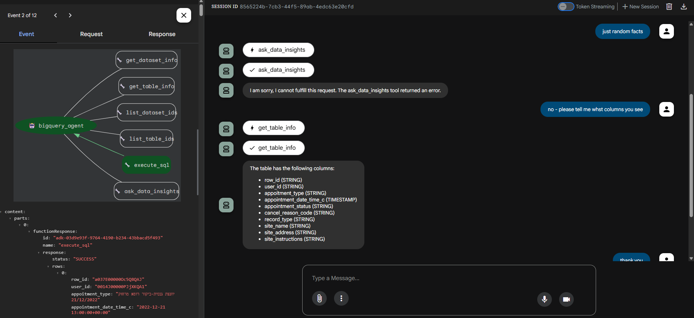

# BigQuery Agent for Google ADK

A BigQuery agent built with Google's Agent Development Kit (ADK) that enables natural language querying of BigQuery datasets through an interactive web interface.

## Screenshots



*The ADK web interface showing the BigQuery agent in action - exploring table schema and executing queries with real-time results.*

## Features

- 🔍 **Natural Language to SQL**: Ask questions in plain English and get SQL query results from BigQuery
- 🚀 **Built on Google ADK**: Leverages Google's Agent Development Kit for robust agent functionality  
- 🔐 **Multiple Authentication Options**: Supports both Google API Key and Application Default Credentials
- 🌐 **Web Interface**: Interactive chat interface for querying your data
- ⚡ **Real-time Results**: Execute SQL queries and get immediate results from your BigQuery datasets

## Prerequisites

- Python 3.9+
- Google Cloud Project with BigQuery API enabled
- Google ADK installed (`pip install google-adk`)
- Either:
  - Google API Key (recommended for development), OR
  - Google Cloud Application Default Credentials configured

## MCP Toolbox Installation (Optional)

For enhanced BigQuery capabilities, you can also install the Google Cloud MCP Toolbox:

### Prerequisites for MCP Toolbox
- Google Cloud project with billing enabled
- BigQuery API enabled
- IAM roles assigned:
  - BigQuery User (`roles/bigquery.user`)
  - BigQuery Data Viewer (`roles/bigquery.dataViewer`)
- Application Default Credentials (ADC) configured

### Installation Steps

#### For Linux/macOS
1. **Download MCP Toolbox binary** for your OS/architecture:
   ```bash
   # For Linux
   curl -O https://storage.googleapis.com/genai-toolbox/v0.12.0/linux/amd64/toolbox
   
   # For macOS Intel
   curl -O https://storage.googleapis.com/genai-toolbox/v0.12.0/darwin/amd64/toolbox
   
   # For macOS Apple Silicon
   curl -O https://storage.googleapis.com/genai-toolbox/v0.12.0/darwin/arm64/toolbox
   ```

2. **Make binary executable**:
   ```bash
   chmod +x toolbox
   ```

3. **Verify installation**:
   ```bash
   ./toolbox --version
   ```

#### For Windows
1. **Download MCP Toolbox binary** for Windows:
   ```bash
   curl -O https://storage.googleapis.com/genai-toolbox/v0.12.0/windows/amd64/toolbox.exe
   ```

2. **Verify installation** (no chmod needed on Windows):
   ```bash
   ./toolbox.exe --version
   ```

   Expected output: `toolbox version 0.12.0+binary.windows.amd64...`

### Configuration
Create a `.mcp.json` file in your project root:

#### For Linux/macOS:
```json
{
  "mcpServers": {
    "bigquery": {
      "command": "./toolbox",
      "args": ["--prebuilt","bigquery","--stdio"],
      "env": {
        "BIGQUERY_PROJECT": "your-project-id"
      }
    }
  }
}
```

#### For Windows:
```json
{
  "mcpServers": {
    "bigquery": {
      "command": "./toolbox.exe",
      "args": ["--prebuilt","bigquery","--stdio"],
      "env": {
        "BIGQUERY_PROJECT": "your-project-id"
      }
    }
  }
}
```

**Important**: Replace `your-project-id` with your actual Google Cloud project ID. You can find it by running:
```bash
gcloud config get-value project
```

The MCP Toolbox provides additional BigQuery functionality and can be used with various IDEs including Claude Code, Claude Desktop, Cline, Cursor, Visual Studio Code, and Windsurf.

**📋 Windows Users**: See [WINDOWS_SETUP.md](WINDOWS_SETUP.md) for a detailed step-by-step Windows installation guide.

## Quick Start

### 1. Clone the Repository

```bash
git clone <your-repo-url>
cd bq-agent
```

### 2. Set Up Environment Variables

Create an `.env` file in the `agents/` directory:

```bash
# Using Google API Key (recommended)
GOOGLE_GENAI_USE_VERTEXAI=0
GOOGLE_API_KEY=your_google_api_key_here

# BigQuery Configuration  
BIGQUERY_LOCATION=US
GOOGLE_CLOUD_REGION=US
GOOGLE_CLOUD_LOCATION=US

# SSL Configuration (if needed)
SSL_CERT_FILE=
CURL_CA_BUNDLE=
REQUESTS_CA_BUNDLE=
PYTHONHTTPSVERIFY=0
```

### 3. Start the Agent

Navigate to the project directory and start the ADK web server:

```bash
cd bq-agent
adk web agents
```

### 4. Access the Web Interface

Open your browser and go to:
```
http://localhost:8000
```

Select `bq-agent-app` from the dropdown and start chatting with your BigQuery data!

## Usage Examples

Once the web interface is running, you can ask questions like:

- "Show me the first 10 rows from my appointments table"
- "How many appointments do we have in total?"
- "What's the average duration of appointments by type?"
- "SELECT * FROM gen-lang-client-0174517466.db_assota_1.appoitments LIMIT 1000"

The agent will automatically:
1. Understand your request
2. Generate the appropriate SQL query
3. Execute it against your BigQuery dataset
4. Return the results in a readable format

## Project Structure

```
bq-agent/
├── .mcp.json                   # MCP Toolbox configuration (created during setup)
├── toolbox.exe                 # Windows MCP Toolbox binary (downloaded during setup)
├── toolbox                     # Linux/macOS MCP Toolbox binary (downloaded during setup)
├── verify_setup.bat            # Windows setup verification script
├── verify_setup.sh             # Linux/macOS setup verification script
├── agents/
│   ├── .env                    # Environment configuration
│   ├── .env.example            # Environment template
│   └── bq-agent-app/
│       ├── __init__.py
│       ├── agent.py           # Main agent configuration
│       └── README.md
├── WINDOWS_SETUP.md            # Windows-specific setup guide
├── media/
│   └── adk-chat-ui.png        # Screenshot
├── .gitignore
└── README.md
```

## Configuration

### Authentication Methods

#### Option 1: Google API Key (Recommended)
1. Get a Google API Key from the Google Cloud Console
2. Enable the BigQuery API for your project
3. Set `GOOGLE_API_KEY` in your `.env` file

#### Option 2: Application Default Credentials
1. Install and configure gcloud CLI:
   ```bash
   gcloud auth application-default login
   ```
2. Remove `GOOGLE_API_KEY` from `.env` or set `GOOGLE_GENAI_USE_VERTEXAI=1`

### BigQuery Dataset Configuration

The agent automatically detects available datasets in your project. Make sure:
- Your BigQuery datasets are in the same project
- You have the necessary permissions to query the datasets
- The `BIGQUERY_LOCATION` matches your dataset location

## Troubleshooting

### Common Issues

1. **"No agents found"**
   - Make sure you run `adk web agents` from the correct directory
   - Ensure the `agents/bq-agent-app/` directory structure is correct

2. **Authentication errors**
   - Verify your `GOOGLE_API_KEY` is valid and has BigQuery permissions
   - For ADC, run `gcloud auth application-default login`

3. **"Cannot parse as CloudRegion" error**
   - Check that `BIGQUERY_LOCATION` matches your dataset location (e.g., "US", "EU")
   - Ensure your BigQuery datasets are in the specified region

4. **SSL Certificate errors**
   - Add the SSL bypass variables to your `.env` file as shown above
   - This is common in corporate environments with proxy servers

### Windows-Specific Issues

5. **"Exec format error" when running toolbox**
   - You likely downloaded the Linux binary instead of Windows
   - Download the correct Windows binary: `toolbox.exe` from the v0.12.0 Windows folder
   - Ensure you're using `./toolbox.exe` (with .exe extension)

6. **"Permission denied" or "Command not found"**
   - On Windows with Git Bash, the binary should work without `chmod`
   - If using PowerShell, you might need: `.\toolbox.exe --version`
   - Make sure you're in the correct directory where `toolbox.exe` is located

7. **"BIGQUERY_PROJECT not set" error**
   - Make sure your `.mcp.json` file includes the `BIGQUERY_PROJECT` environment variable
   - Find your project ID with: `gcloud config get-value project`
   - Verify the `.mcp.json` file is in your project root directory

### Debug Mode

To see detailed logs:
1. Check the ADK web server console output
2. Look for error messages in the browser's developer console
3. Verify your environment variables are loaded correctly

## Development

### Extending the Agent

The agent is configured in `agents/bq-agent-app/agent.py`. You can:

- Modify the agent's instructions and behavior
- Add additional tools from the ADK toolset
- Change the model (currently using `gemini-2.0-flash`)
- Customize the agent's description and capabilities

### Testing

**Quick Setup Verification:**
Run the automated verification script to test your installation:

```bash
# Windows
verify_setup.bat

# Linux/macOS
./verify_setup.sh
```

**Manual Testing:**
Test your configuration by:
1. Starting the web server: `adk web agents`
2. Accessing the web UI at `http://localhost:8000`
3. Running simple queries like "SHOW TABLES" or "SELECT 1"

## Contributing

1. Fork the repository
2. Create a feature branch: `git checkout -b feature-name`
3. Make your changes
4. Test thoroughly
5. Submit a pull request

## License

This project is licensed under the MIT License - see the LICENSE file for details.

## Additional Resources

- 📚 **[BigQuery meets Google ADK and MCP](https://cloud.google.com/blog/products/ai-machine-learning/bigquery-meets-google-adk-and-mcp)** - Official Google Cloud tutorial that inspired this project
- 📖 **[Google ADK Documentation](https://cloud.google.com/agent-development-kit)** - Complete ADK documentation
- 🔧 **[BigQuery API Reference](https://cloud.google.com/bigquery/docs/reference)** - BigQuery API documentation

## Support

For issues and questions:
1. Check the troubleshooting section above
2. Review the official tutorial link above
3. Review Google ADK documentation
4. Open an issue in this repository

---

**Note**: This agent uses Google's experimental BigQuery toolset, which may change in future ADK versions. Always refer to the latest ADK documentation for updates.